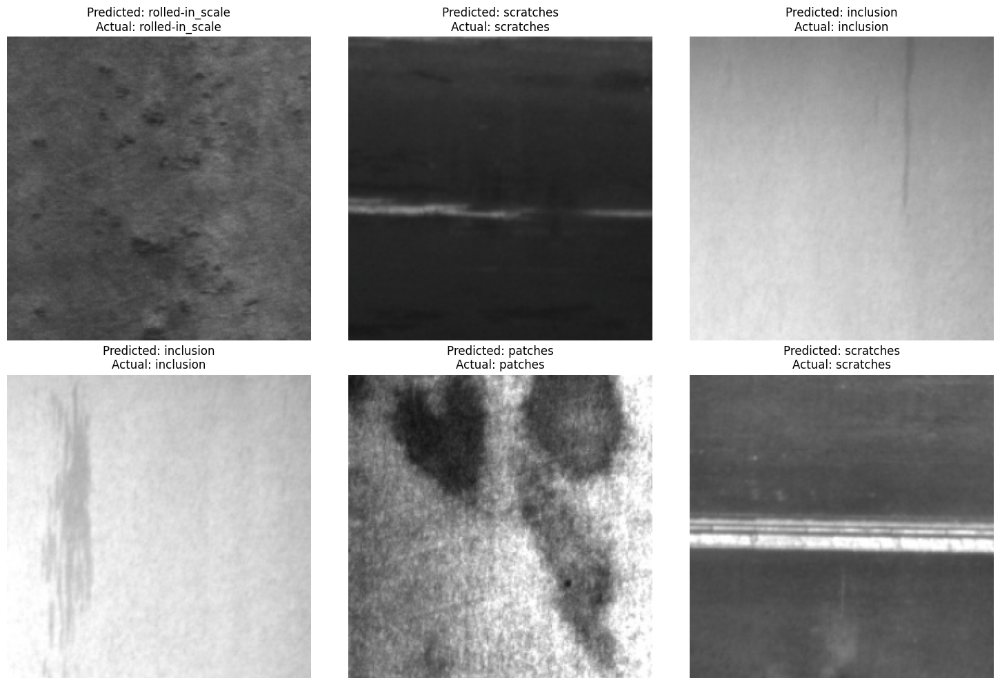

# Steel Surface Defect Classification (Transfer Learning)

**Domain:** manufacturing quality inspection · **Type:** multi-class image classification · **Stack:** PyTorch, torchvision

[View notebook](steel_defect_transfer_learning.ipynb) · [Open in nbviewer](https://nbviewer.org/github/votmh256/huy-vo-ai-lab/blob/main/01-steel-defect-classification/steel_defect_transfer_learning.ipynb)

## Problem
Manual visual inspection of steel surfaces is slow, inconsistent and hard to scale. The goal: automatically classify six common surface defects (crazing, inclusion, patches, pitted surface, rolled-in scale, scratches) from industrial images.

## Data
NEU Surface Defect Dataset: 1,800 grayscale images, balanced at 300 per class (1,440 train / 360 validation).

## Approach
- Converted grayscale images to 3-channel RGB, resized to 224×224 and normalised with ImageNet statistics so they match what the pretrained network expects.
- Loaded **MobileNetV2** with ImageNet weights, chosen because it is lightweight enough to train on a CPU.
- **Froze the entire feature extractor** and replaced the classifier head with a new 6-class layer, so only **7,686 of 2.2M parameters** were trained.
- Trained for 5 epochs with Adam (lr 0.001) and cross-entropy loss.

## Results
- **97.2% validation accuracy** on the 360 validation images.
- Training loss fell from 0.60 to 0.07, with only a small gap between training and validation performance.

## What I'd do before production
- Report per-class precision and recall and a confusion matrix, since missing one defect type can matter more than overall accuracy.
- Fine-tune the top backbone layers, and test on images from a different production line or camera to check robustness.
- Add a confidence threshold so uncertain images go to a human inspector (human-in-the-loop), and monitor drift as materials and lighting change.
