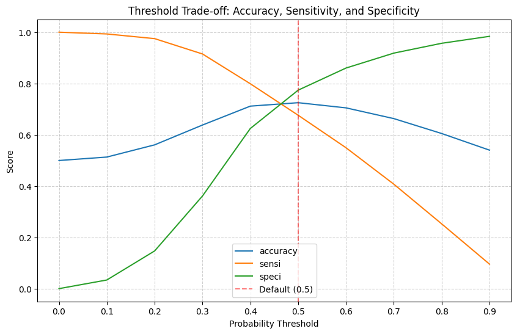
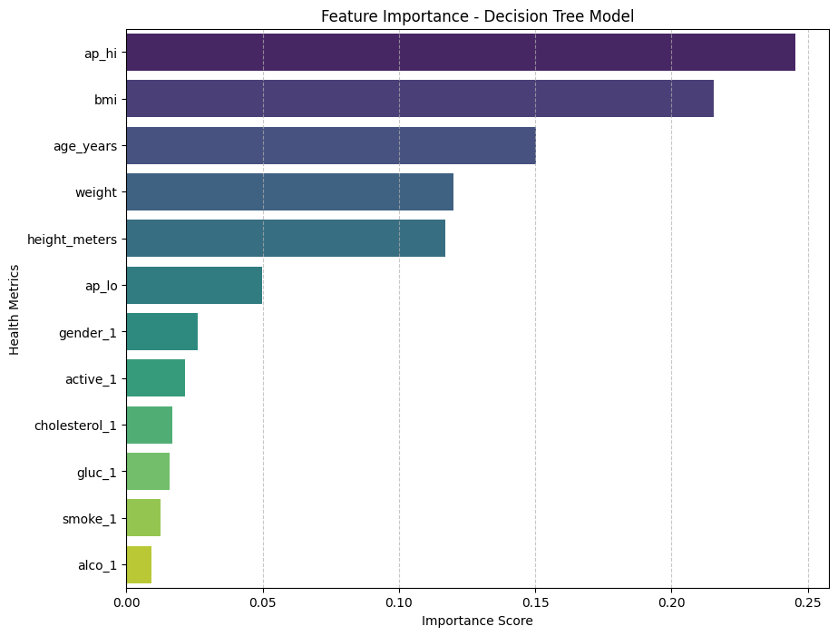

# Cardiovascular Risk Classification

**Domain:** healthcare triage · **Type:** binary classification · **Stack:** scikit-learn, pandas, Seaborn

[View notebook](cardio_risk_classification.ipynb) · [Open in nbviewer](https://nbviewer.org/github/votmh256/huy-vo-ai-lab/blob/main/02-cardio-risk-classification/cardio_risk_classification.ipynb)

## Problem
A clinic wants to flag patients at risk of cardiovascular disease so doctors can prioritise consultations. The costly error here is a **false negative**, i.e. missing an at-risk patient, so recall matters more than raw accuracy.

## Data
~70K patient records with age, gender, height, weight, blood pressure, cholesterol, glucose and lifestyle factors (smoking, alcohol, activity).

## Approach
- **Cleaning:** removed physiologically impossible blood-pressure readings and converted age to years and height to metres.
- **Feature engineering:** created BMI, merged sparse "above normal" cholesterol and glucose categories into one "elevated" indicator, one-hot encoded categoricals and applied Min-Max scaling.
- **Models:** a linear SVM (with probability estimates) and a decision tree.
- **Overfitting fix:** the baseline tree scored 98% on train but 63% on test. GridSearchCV (5-fold, 160 candidates) chose max_depth 10 and min_samples_split 50, which closed the gap to about 2 points.
- **Threshold tuning:** analysed accuracy, sensitivity and specificity across cut-offs and chose **0.4** to favour recall.
- Documented both final models with **model cards** covering intended use, limitations and fairness considerations.

## Results

| Model (test set, 0.4 threshold) | Accuracy | Precision | Recall |
|---|---|---|---|
| Linear SVM | 71.2% | 68.0% | **79.9%** |
| Tuned decision tree | 71.4% | 68.7% | 78.4% |

Moving the SVM threshold from 0.5 to 0.4 lifted recall from 67.6% to 79.9%. Systolic blood pressure, BMI and age were the strongest predictors.

## What I'd do before production
- Choose between the models with clinicians: the SVM gives slightly higher recall, while the tree is easier to explain to doctors and patients.
- Check performance across gender and age groups for fairness, and calibrate probabilities before showing risk scores.
- Treat it as decision support (a prioritised list for doctors), not an automated diagnosis.
