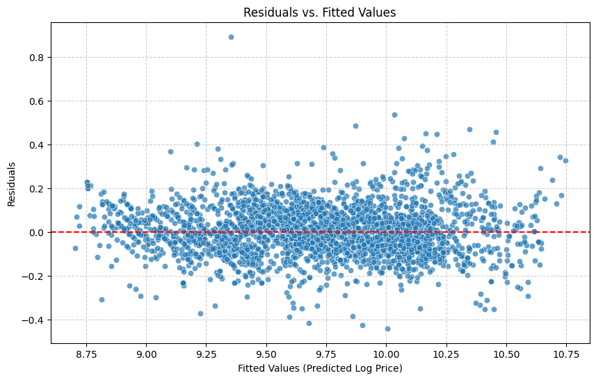

# Used-Car Price Regression

**Domain:** marketplace pricing · **Type:** regression · **Stack:** scikit-learn, statsmodels, pandas

[View notebook](car_price_regression.ipynb) · [Open in nbviewer](https://nbviewer.org/github/votmh256/huy-vo-ai-lab/blob/main/03-car-price-regression/car_price_regression.ipynb)

## Problem
Predict the listing price of a used car from its attributes, e.g. to give sellers pricing guidance or flag listings that look mispriced.

## Data
15.9K used-car listings with make/model, body type, mileage, age, engine power, fuel, gearing, previous owners and equipment packages.

## Approach
- **Target:** log-transformed price (log1p) to handle right skew.
- **Outliers:** winsorised mileage, engine power and fuel consumption.
- **Features:** split multi-value equipment fields (comfort, entertainment, safety, extras) into binary flags and one-hot encoded categoricals, giving **87 features**, then standardised them.
- **Models:** baseline linear regression, then **Ridge** and **Lasso**, with alpha tuned by 5-fold GridSearchCV (coarse, then fine-grained search).
- Checked linear-regression assumptions with residual plots.

## Results

| Model | MAE (log price) | RMSE | R² |
|---|---|---|---|
| Linear regression | 0.0804 | 0.1077 | 0.9275 |
| Ridge (α ≈ 29.8) | 0.0804 | 0.1077 | 0.9275 |
| Lasso (α ≈ 0.0003) | 0.0803 | 0.1076 | **0.9275** |

Regularisation barely changed performance, which suggests the baseline wasn't overfitting. Lasso set 7 low-value features to zero, giving a simpler model at the same accuracy. Among the numeric features, engine power, age and mileage were the strongest price drivers, and make/model also had a large effect.

## What I'd do before production
- Report errors in currency (back-transformed from log) so the business can judge whether they're acceptable.
- Try tree-based models (e.g. gradient boosting) to capture non-linear effects between make, age and mileage.
- Retrain regularly, since used-car prices shift with the market.
