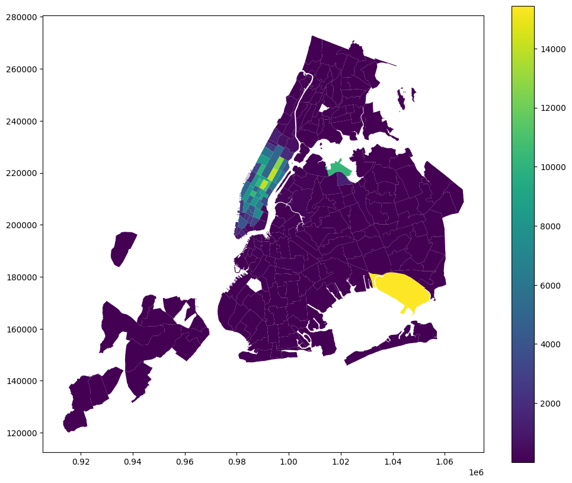
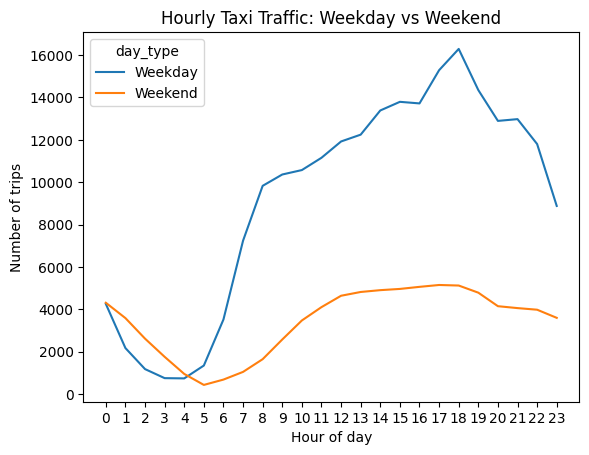

# NYC Taxi Operations Analysis (EDA)

**Domain:** mobility operations · **Type:** exploratory data analysis · **Stack:** pandas, GeoPandas, Matplotlib, Seaborn

[View notebook](nyc_taxi_eda.ipynb) · [Open in nbviewer](https://nbviewer.org/github/votmh256/huy-vo-ai-lab/blob/main/04-nyc-taxi-eda/nyc_taxi_eda.ipynb)

## Problem
Use the 2023 NYC yellow taxi trip records to find patterns in demand, fares, tips and pickup zones that could improve operational efficiency, revenue and passenger experience.

## Data
[NYC TLC trip records](https://www.nyc.gov/site/tlc/about/tlc-trip-record-data.page) for 2023 (12 monthly parquet files, tens of millions of trips) plus the NYC taxi zone shapefile (263 zones).

## Approach
- **Stratified sampling:** kept a random 0.8% of trips from every hour of every day across all 12 months, giving **303K trips** that preserve hourly, daily and monthly patterns.
- **Cleaning:** fixed and combined columns (e.g. merged the two airport-fee fields), handled missing values (about 3.4% in several fields) and treated outliers caused by errors in how trips were recorded.
- **Analysis:** temporal (hour, day, month), financial (revenue, fare vs distance and duration, tips, payment types, fare per mile by vendor and distance tier), geographical (choropleth of pickups by zone, top pickup and drop-off zones) and customer factors (passenger counts, surcharges).

## Highlights
- **JFK Airport** is the single busiest pickup zone, followed by Upper East Side South and Midtown Center.
- Weekday demand peaks in the **late afternoon and early evening (around 17:00–18:00)**, while weekend demand is flatter.

## Recommendations
[To be added]
